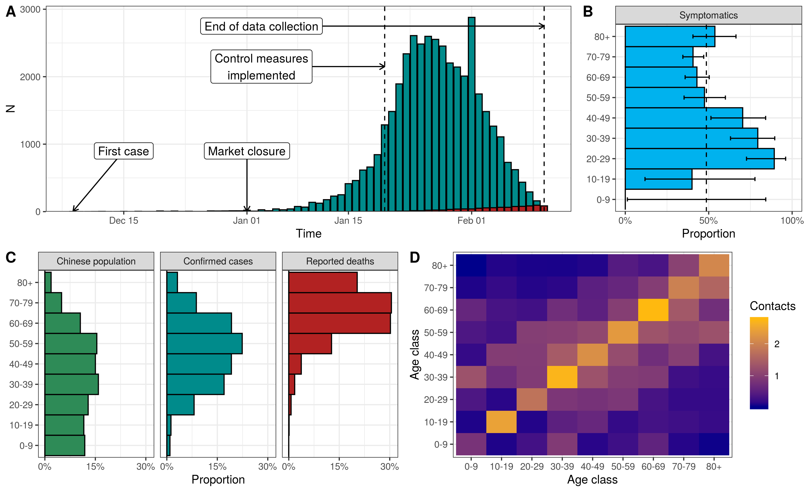

# Adjusted age-specific case fatality ratio during the COVID-19 epidemic in Hubei, China, January and February 2020

Julien Riou (julien.riou@ispm.unibe.ch), Anthony Hauser (anthony.hauser@ispm.unibe.ch), Michel J. Counotte (michel.counotte@ispm.unibe.ch) and Christian L. Althaus (christian.althaus@ispm.unibe.ch)

*Institute of Social and Preventive Medicine, University of Bern, Switzerland*

*Abstract.* The coronavirus disease 2019 (COVID-19) epidemic that originated in Wuhan, China has spread to more than 60 countries.
We estimated the age-specific case fatality ratio (CFR) by fitting a transmission model to data from China, accounting for underreporting of cases and the time delay to death.
Overall CFR among all infections was 1.6% (1.4-1.8%) and increased considerable for the elderly, highlighting the expected burden for populations with further expansion of the COVID-19 epidemic around the globe.

*Figure.*  (A) Reported confirmed cases of COVID-19 in the Hubei province by date of disease onset (blue) and reported deaths (red) from 8 December 2019 to 11 February 2020.
(B) Age distribution of the Chinese population compared to that of confirmed cases of and deaths due to COVID-19. (C) Proportion of individuals
infected by COVID-19 showing symptoms among passengers of the Diamond Princess ship (with 95% credible interval).
